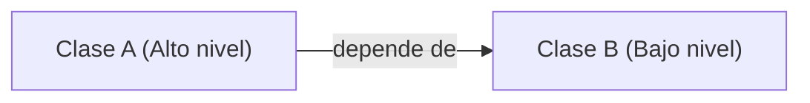
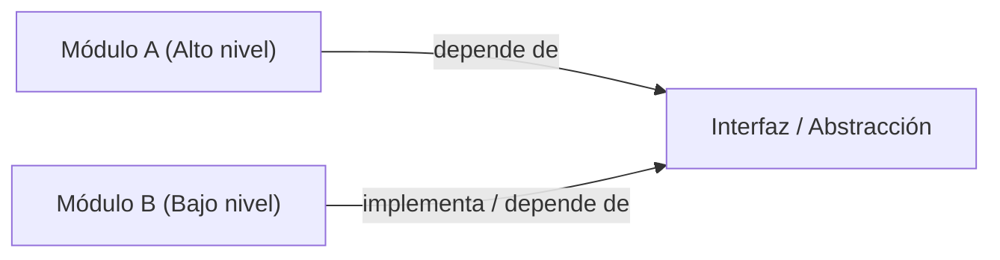
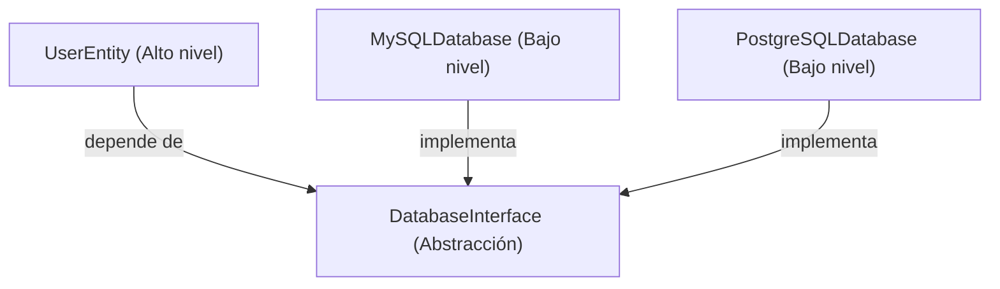

# Parte 1: Fundamentos de Clean Architecture en Python

## Capítulo 2: Fundamentos de SOLID: Construcción de aplicaciones robustas en Python

En el capítulo anterior, exploramos Clean Architecture, un enfoque poderoso para construir aplicaciones en Python que sean mantenibles, flexibles y escalables. Aprendimos cómo separa las responsabilidades en capas diferenciadas, desde la lógica de negocio central hasta las interfaces externas, promoviendo la independencia y la capacidad de prueba (*testability*). Ahora, profundizaremos en un conjunto de principios que constituyen la base de Clean Architecture. Estos se conocen como los principios **SOLID**.

El acrónimo SOLID ([https://en.wikipedia.org/wiki/SOLID](https://en.wikipedia.org/wiki/SOLID)) representa cinco principios clave de la programación y el diseño orientados a objetos. Cuando se aplican correctamente, estos principios ayudan a los desarrolladores a crear estructuras de software más comprensibles, flexibles y mantenibles. En este capítulo, exploraremos cada uno de estos principios en profundidad, centrándonos en su aplicación en Python y en cómo respaldan los objetivos de Clean Architecture que discutimos anteriormente.

Al finalizar este capítulo, tendrás una comprensión clara de los siguientes aspectos:

- El **Principio de Responsabilidad Única** (**Single Responsibility Principle - SRP**) y su papel en la creación de código enfocado y mantenible.
- El **Principio de Abierto/Cerrado** (**Open–Closed Principle - OCP**) y cómo permite la construcción de sistemas extensibles.
- El **Principio de Segregación de Interfaces** (**Interface Segregation Principle - ISP**) y su aplicación en el entorno de tipado de pato (*duck typing*) de Python.
- El **Principio de Sustitución de Liskov** (**Liskov Substitution Principle - LSP**) y su importancia en el diseño de abstracciones robustas.
- El **Principio de Inversión de Dependencias** (**Dependency Inversion Principle - DIP**) y su papel crucial en el respaldo de la Regla de Dependencia de Clean Architecture.

Examinaremos cada principio a través del prisma del desarrollo en Python, proporcionando ejemplos prácticos y mejores prácticas. Aprenderás a aplicar estos principios para escribir código Python más limpio y mantenible, sentando una base sólida para implementar Clean Architecture en tus proyectos.

---

### Sección 2.1: Requisitos técnicos

Los ejemplos de código presentados en este capítulo y a lo largo del resto del libro se han probado con Python 3.13. Por brevedad, los ejemplos de código en el capítulo pueden estar implementados parcialmente. Las versiones completas de todos los ejemplos se pueden encontrar en el repositorio complementario de GitHub del libro en [https://github.com/PacktPublishing/Clean-Architecture-with-Python](https://github.com/PacktPublishing/Clean-Architecture-with-Python).

#### Una nota sobre el orden en que cubriremos los principios SOLID

Si bien los principios SOLID se presentan tradicionalmente en el orden de sus siglas, este libro adopta una secuencia más estratégica. Cubriremos primero el SRP, luego el OCP, después el ISP, seguido del LSP y, finalmente, el DIP. El inicio de cada sección detallará la relación entre su tema y los anteriores. Este orden genera una progresión natural desde la escritura de código limpio y modular hasta el diseño de sistemas flexibles y mantenibles, respaldando directamente los objetivos de Clean Architecture.

---

### Sección 2.2: Creación de código enfocado y mantenible: el poder de la responsabilidad única (SRP)

En la jerarquía del diseño de software, tenemos la arquitectura de alto nivel en la cúspide, seguida por los componentes, los módulos, las clases y, finalmente, las funciones. Los principios SOLID operan principalmente a nivel de módulo, proporcionando pautas para crear código bien estructurado y mantenible. Estas prácticas a nivel de módulo constituyen la base de una buena arquitectura en general, incluida Clean Architecture. Al aplicar los principios SOLID, podemos crear componentes débilmente acoplados (*loosely coupled*) y altamente cohesivos (*highly cohesive*) que resultan más fáciles de probar, modificar y extender. Estas cualidades son atributos fundamentales de Clean Architecture.

#### Comprensión de la responsabilidad única

El **Principio de Responsabilidad Única** (**Single Responsibility Principle - SRP**) establece que cada módulo de software debe tener una, y solo una, razón para cambiar ([https://blog.cleancoder.com/uncle-bob/2014/05/08/SingleReponsibilityPrinciple.html](https://blog.cleancoder.com/uncle-bob/2014/05/08/SingleReponsibilityPrinciple.html)).

A primera vista, el concepto de responsabilidad única puede parecer sencillo. Sin embargo, en la práctica, definirlo e implementarlo puede resultar desafiante. Consideremos un ejemplo simple para ilustrar este principio.

Consideremos una clase `User` concebida para actuar como una entidad en una aplicación de redes sociales. Recordemos que las entidades en Clean Architecture deben representar objetos de negocio centrales con las reglas más generales:

```python
class User:
    def __init__(self, user_id: str, username: str, email: str):
        self.user_id = user_id
        self.username = username
        self.email = email
        self.posts = []

    def create_post(self, content: str) -> dict:
        post = {"id": len(self.posts) + 1, "content": content, "likes": 0}
        self.posts.append(post)
        return post

    def get_timeline(self) -> list:
        # Fetch and return the user's timeline
        # This might involve complex logic to fetch and
        # sort posts from followed users
        pass

    def update_profile(self, new_username: str = None, new_email: str = None):
        if new_username:
            self.username = new_username
        if new_email:
            self.email = new_email
```

Inicialmente, esta clase `User` puede parecer razonable. Encapsula los datos del usuario y proporciona métodos para acciones comunes del usuario en una aplicación de redes sociales. Sin embargo, aunque está destinada a ser una entidad, se desvía significativamente del concepto de Clean Architecture introducido en el [Capítulo 1](https://subscription.packtpub.com/book/programming/9781836642893/1). Recuerda que las entidades deben representar objetos de negocio centrales que encapsulan las reglas más generales y de alto nivel, independientes de comportamientos específicos de la aplicación o preocupaciones externas. Nuestra clase `User` actual viola estos principios al asumir demasiadas responsabilidades:

- **Gestión de datos de usuario** (manejo de `user_id`, `username` y `email`).
- **Creación y gestión de publicaciones (posts)**.
- **Generación del cronograma (timeline)**.
- **Actualizaciones de perfil**.

Esta estructura combina datos centrales del usuario con comportamientos específicos de la aplicación, violando tanto el SRP como el concepto de entidad. A medida que el producto crezca, esta clase podría convertirse en un cuello de botella, provocando dificultades de desarrollo, conflictos de fusión (*merge conflicts*) y efectos secundarios no deseados.

Al identificar y separar responsabilidades, considera estos consejos:

- Busca grupos de métodos que operen sobre diferentes subconjuntos de los datos de la clase.
- Considera qué aspectos se verían afectados por diferentes tipos de cambios o requisitos.
- Utiliza la heurística de la *razón para cambiar*: si puedes pensar en más de una razón para que la clase cambie, considera dividirla.

Refactoricemos nuestra clase `User` para que cumpla con el SRP y el concepto de entidad:

```python
class User:
    def __init__(self, user_id: str, username: str, email: str):
        self.user_id = user_id
        self.username = username
        self.email = email


class PostManager:
    def create_post(self, user: User, content: str):
        post = {
            "id": self.generate_post_id(),
            "user_id": user.user_id,
            "content": content,
            "likes": 0,
        }
        # Logic to save the post
        return post

    def generate_post_id(self):
        # Logic to generate a unique post ID
        pass


class TimelineService:
    def get_timeline(self, user: User) -> list:
        # Fetch and return the user's timeline
        # This might involve complex logic to fetch and sort posts from followed users
        pass


class ProfileManager:
    def update_profile(
        self, user: User, new_username: str = None, new_email: str = None
    ):
        if new_username:
            user.username = new_username
        if new_email:
            user.email = new_email
        # Additional logic for profile updates, like triggering email verification
```

Esta versión refactorizada no solo se adhiere más estrechamente al SRP, sino que también se alinea con el concepto de entidades en Clean Architecture. Desglosemos los cambios y sus implicaciones:

- `User`: Ahora reducida a su esencia, la clase `User` encarna verdaderamente una entidad. Encapsula las reglas más generales y de alto nivel, de manera independiente a los comportamientos específicos de la aplicación. Tiene una única responsabilidad: gestionar los datos esenciales del usuario.
- `PostManager`: Asume la responsabilidad enfocada de crear y gestionar publicaciones.
- `TimelineService`: Maneja la lógica de generación del cronograma de forma independiente.
- `ProfileManager`: Gestiona las actualizaciones del perfil, reduciendo aún más las responsabilidades de la clase `User`.

Cada una de estas clases tiene ahora un rol claro y enfocado que se adhiere al SRP y promueve la separación de responsabilidades (*separation of concerns*). Esta refactorización aporta varios beneficios:

- **Mantenibilidad y facilidad de prueba mejoradas**: Cada clase tiene un propósito único y bien definido, lo que facilita su comprensión, modificación y prueba de forma independiente.
- **Mayor flexibilidad y menor acoplamiento**: Podemos extender o modificar un aspecto del sistema sin afectar a los demás, haciendo que nuestra base de código sea más resistente al cambio.

Este diseño modular y flexible encaja a la perfección con los principios de Clean Architecture, creando límites claros entre los diferentes componentes de nuestro sistema. Si bien puede parecer excesivo para una aplicación pequeña, sienta las bases para un sistema más mantenible y escalable a medida que crece.

Recuerda que la mayoría de nosotros trabajamos en aplicaciones que aspiramos a que tengan éxito. Con el éxito llegan solicitudes de nuevas características, giros estratégicos (*pivots*) y desafíos de escalabilidad. Prepararse para este crecimiento desde el principio aplicando el SRP con criterio puede ahorrar un esfuerzo significativo de refactorización más adelante, creando una estructura que es tanto flexible como comprensible a medida que el sistema evoluciona.

#### SRP y las pruebas (Testing)

Las clases con una sola responsabilidad suelen ser más fáciles de probar, ya que tienen menos dependencias y casos extremos. Esto facilita la creación de sistemas comprobables mediante pruebas (*testable systems*), un principio fundamental de Clean Architecture. Por ejemplo, probar `PostManager` se vuelve algo directo:

```python
import unittest

from post_manager import PostManager
from user import User


class TestPostManager(unittest.TestCase):
    def test_create_post(self):
        user = User("123", "testuser", "test@example.com")
        post_manager = PostManager()
        post = post_manager.create_post(user, "Hello, world!")

        self.assertEqual(post["user_id"], "123")
        self.assertEqual(post["content"], "Hello, world!")
        self.assertEqual(post["likes"], 0)
        self.assertIn("id", post)
```

Este caso de prueba demuestra la claridad que aporta el SRP a las pruebas unitarias. Aquí, `PostManager`, con su única responsabilidad, se prueba fácilmente de forma aislada sin una configuración compleja ni la necesidad de crear mocks. Podemos verificar todos los aspectos esenciales de la creación de publicaciones de forma directa. Esta simplicidad en las pruebas es un beneficio directo del SRP y se alinea con los principios de Clean Architecture. A medida que los sistemas se vuelven más complejos, la capacidad de probar responsabilidades individuales de forma aislada se vuelve crucial. Nos permite mantener una alta calidad de código, detectar problemas tempranamente y hacer evolucionar nuestra suite de pruebas junto con el sistema, garantizando la corrección de cada componente enfocado sin necesidad de recurrir a complejas pruebas de integración.

#### Equilibrar el SRP

Aunque el SRP es un principio poderoso, es importante no llevarlo a los extremos. La sobreaplicación del SRP puede provocar una explosión de clases y funciones minúsculas, lo que puede dificultar la comprensión y la navegación por el sistema en su conjunto. Malinterpretar el SRP creyendo que una clase o módulo debe hacer solo *una acción* puede llevar a la creación de demasiadas clases diminutas. El principio trata sobre *razones únicas para cambiar*, no estrictamente sobre *acciones únicas realizadas*.

La clave está en encontrar un equilibrio, donde cada unidad de código (ya sea una clase, función o módulo) tenga un propósito claro y cohesivo, sin volverse tan granular que la estructura general se fragmente. Recuerda que el objetivo del SRP es hacer que tu código sea más mantenible y comprensible. Si dividir una clase o función hace que el sistema general sea más difícil de entender, puede que no sea la decisión adecuada. Usa tu juicio y considera siempre el contexto de tu aplicación específica.

En resumen, el SRP proporciona una base sólida para crear código mantenible y flexible. Al garantizar que cada módulo o clase tenga un propósito único y bien definido, sentamos las bases para sistemas que son más fáciles de entender, modificar y extender. Como hemos visto, la clave radica en encontrar el equilibrio adecuado para tu contexto específico a fin de evitar los extremos de clases excesivamente complejas o una explosión de componentes diminutos y fragmentados.

Este principio de aplicación equilibrada se extiende a lo largo de toda la Clean Architecture. Cada patrón y capa de abstracción que exploramos ofrece beneficios específicos, como una mayor facilidad de prueba, un mantenimiento más sencillo y una mayor flexibilidad, pero también añade complejidad. A medida que avances en este libro, considera cada patrón a través del prisma de tus necesidades específicas. Una startup que construya un MVP podría posponer algunas abstracciones hasta que el crecimiento las exija, mientras que un sistema empresarial podría beneficiarse del enfoque arquitectónico completo desde el primer día. Con el SRP como punto de partida, ahora estamos listos para explorar cómo el OCP se construye sobre esta base.

---

### Sección 2.3: Construcción de sistemas extensibles: adoptando el diseño abierto-cerrado en Python (OCP)

Habiendo explorado el SRP y su papel en la creación de clases enfocadas y mantenibles, dirigiremos nuestra atención a otro aspecto crucial del diseño de software robusto: la extensibilidad. El **Principio de Abierto/Cerrado** (**Open–Closed Principle - OCP**), introducido por Bertrand Meyer en 1988 ([https://en.wikipedia.org/wiki/Open%E2%80%93closed_principle](https://en.wikipedia.org/wiki/Open%E2%80%93closed_principle)), se construye sobre la base establecida por el SRP. Nos guía en la creación de sistemas que se definen como *abiertos para la extensión pero cerrados para la modificación*. Esto significa que deberíamos ser capaces de agregar nueva funcionalidad sin cambiar el código existente, extendiendo esencialmente el comportamiento de nuestro sistema mediante código nuevo en lugar de modificar lo que ya está en funcionamiento.

El OCP es una herramienta poderosa en nuestro conjunto de principios SOLID, ya que trabaja en armonía con el SRP para crear código modular y flexible. Aborda un desafío común en el desarrollo de software: cómo agregar nuevas características o comportamientos sin alterar el código existente y ya probado. Al adherirnos al OCP, podemos diseñar nuestras clases y módulos de Python para que puedan extenderse fácilmente, reduciendo el riesgo de introducir errores al agregar nueva funcionalidad.

En el contexto de Clean Architecture, el OCP desempeña un papel vital en la creación de sistemas que pueden adaptarse al cambio a lo largo del tiempo. Respalda la creación de una lógica de negocio central y estable que permanece intacta a medida que agregamos nuevas funciones o nos adaptamos a nuevas tecnologías. A medida que exploremos el OCP en Python, veremos cómo contribuye a la construcción de aplicaciones mantenibles y escalables que se alinean con los principios de Clean Architecture.

Exploremos este principio utilizando un ejemplo práctico de un calculador de áreas para diferentes figuras geométricas. Consideremos la siguiente implementación inicial:

```python
class Rectangle:
    def __init__(self, width, height):
        self.width = width
        self.height = height


class Circle:
    def __init__(self, radius):
        self.radius = radius


class AreaCalculator:
    def calculate_area(self, shape):
        if isinstance(shape, Rectangle):
            return shape.width * shape.height
        elif isinstance(shape, Circle):
            return 3.14 * shape.radius**2
        else:
            raise ValueError("Unsupported shape")


# Usage
rectangle = Rectangle(5, 4)
circle = Circle(3)

calculator = AreaCalculator()
print(f"Rectangle area: {calculator.calculate_area(rectangle)}")
print(f"Circle area: {calculator.calculate_area(circle)}")
```

Aquí tenemos una clase simple `AreaCalculator` que puede calcular el área de rectángulos y círculos. Sin embargo, este diseño viola el OCP. Si deseamos agregar soporte para una nueva figura, como un triángulo, tendríamos que modificar el método `calculate_area` de la clase `AreaCalculator`. Esta modificación podría introducir potencialmente errores en el código funcional existente.

Para cumplir con el OCP, necesitamos reestructurar nuestro código de modo que podamos agregar nuevas figuras sin modificar la clase `AreaCalculator` existente. Así es como podemos refactorizar este código para que adopte el OCP:

```python
import math
from abc import ABC, abstractmethod


class Shape(ABC):
    @abstractmethod
    def area(self):
        pass


class Rectangle(Shape):
    def __init__(self, width, height):
        self.width = width
        self.height = height

    def area(self):
        return self.width * self.height


class Circle(Shape):
    def __init__(self, radius):
        self.radius = radius

    def area(self):
        return math.pi * self.radius**2


class AreaCalculator:
    def calculate_area(self, shape: Shape):
        return shape.area()


# Usage
rectangle = Rectangle(5, 4)
circle = Circle(3)

calculator = AreaCalculator()
print(f"Rectangle area: {calculator.calculate_area(rectangle)}")
print(f"Circle area: {calculator.calculate_area(circle)}")


# Adding a new shape without modifying AreaCalculator
class Triangle(Shape):
    def __init__(self, base, height):
        self.base = base
        self.height = height

    def area(self):
        return 0.5 * self.base * self.height


triangle = Triangle(6, 4)
print(f"Triangle area: {calculator.calculate_area(triangle)}")
```

En esta versión refactorizada, hemos realizado varios cambios clave para adherirnos al concepto de OCP:

- Introdujimos una clase abstracta `Shape` con un método `area`. Esta actúa como la interfaz que todas las figuras deben implementar.
- Cada figura concreta (`Rectangle`, `Circle` y ahora `Triangle`) hereda de `Shape` e implementa su propio método `area`.
- La clase `AreaCalculator` ahora depende de la clase abstracta `Shape` en lugar de implementaciones concretas. Llama al método `area` en cualquier objeto de figura que reciba, sin necesidad de conocer el tipo específico de figura.
- Ahora podemos agregar nuevas figuras (como `Triangle`) sin modificar la clase `AreaCalculator`. El sistema está abierto para la extensión pero cerrado para la modificación.

Este diseño refactorizado ejemplifica el OCP en acción, al tiempo que mantiene la adherencia al SRP. Examinemos los aspectos clave:

- **Abierto para la extensión**: Podemos agregar nuevas figuras (como `Triangle`) sin modificar el código existente. Cada clase de figura tiene la responsabilidad única de definir sus propiedades y calcular su propia área.
- **Cerrado para la modificación**: La clase central `AreaCalculator` permanece inalterada al agregar nuevas figuras, demostrando el cierre frente a la modificación.
- **Polimorfismo**: Al usar una clase abstracta `Shape`, podemos tratar diferentes objetos de figuras de manera uniforme. Esto permite que `AreaCalculator` trabaje con cualquier figura a través de una interfaz común, sin conocer las implementaciones específicas.

Este diseño se alinea perfectamente con los objetivos de Clean Architecture:

- **Extensibilidad**: Los nuevos requisitos (como agregar figuras) pueden satisfacerse sin alterar el código existente y probado.
- **Aislamiento de la lógica central**: El cálculo del área de cada figura está protegido de cambios externos.
- **Facilidad de prueba (Testability)**: La clara separación de responsabilidades facilita las pruebas unitarias directas.

Al combinar OCP y SRP, hemos creado una base para construir sistemas más grandes y complejos que pueden evolucionar sin volverse frágiles. Este ejemplo, aunque pequeño, demuestra cómo los principios de Clean Architecture pueden aplicarse eficazmente en Python para crear sistemas bien organizados, mantenibles y adaptables a requisitos cambiantes.

---

### Sección 2.4: ISP: adaptación de interfaces a los clientes

A medida que profundizamos en los principios SOLID, hemos visto cómo el SRP promueve clases enfocadas y el OCP permite la extensibilidad. Ahora dirigiremos nuestra atención a las interfaces que estas clases exponen al exterior. El **Principio de Segregación de Interfaces** (**Interface Segregation Principle - ISP**) ([https://en.wikipedia.org/wiki/Interface_segregation_principle](https://en.wikipedia.org/wiki/Interface_segregation_principle)) nos guía en la creación de interfaces esbeltas y de propósito específico que atienden las necesidades exactas de sus clientes. Este principio es crucial para desarrollar código Python flexible y modular que sea fácil de entender y mantener.

El ISP no solo se basa en el concepto de responsabilidad única introducido por el SRP, sino que también lo aplica a nivel de interfaz. Aboga por diseñar interfaces estrechamente enfocadas en tareas específicas, en lugar de interfaces que intenten abarcar demasiadas responsabilidades. Este enfoque conduce a sistemas más flexibles y mantenibles, ya que los clientes solo dependen de los métodos que realmente utilizan.

Para ilustrar la importancia del ISP y cómo se relaciona con clases que intentan hacer demasiado, consideremos un ejemplo de un sistema de reproducción multimedia:

```python
from abc import ABC, abstractmethod


class MultimediaPlayer(ABC):
    @abstractmethod
    def play_media(self, file: str) -> None:
        pass

    @abstractmethod
    def stop_media(self) -> None:
        pass

    @abstractmethod
    def display_lyrics(self, file: str) -> None:
        pass

    @abstractmethod
    def apply_video_filter(self, filter: str) -> None:
        pass


class MusicPlayer(MultimediaPlayer):
    def play_media(self, file: str) -> None:
        # Implementation for playing music
        print(f"Playing music: {file}")

    def stop_media(self) -> None:
        # Implementation for stopping music
        print("Stopping music")

    def display_lyrics(self, file: str) -> None:
        # Implementation for displaying lyrics
        print(f"Displaying lyrics for: {file}")

    def apply_video_filter(self, filter: str) -> None:
        # This method doesn't make sense for a MusicPlayer
        raise NotImplementedError("MusicPlayer does not support video filters")


class VideoPlayer(MultimediaPlayer):
    # Implementation for video player
    ...
```

Este diseño viola el ISP al intentar hacer demasiado (exceso de métodos). Examinemos los problemas que surgen de este enfoque:

- **Métodos innecesarios y una API confusa**: Aquí, `MusicPlayer` se ve obligado a implementar `apply_video_filter`, lo cual no tiene sentido para un reproductor de solo audio. Esto conduce a implementaciones forzadas y a posibles errores en tiempo de ejecución. Además, los usuarios de la clase `MusicPlayer` ven métodos como `apply_video_filter` en la interfaz, lo que puede generar confusión sobre lo que la clase realmente puede hacer. Esta falta de claridad dificulta el uso correcto de la clase y aumenta el riesgo de un uso indebido.
- **Falta de modularidad**: La interfaz no permite crear fácilmente reproductores especializados. Por ejemplo, no podemos crear de manera sencilla una pantalla exclusiva para letras de canciones sin tener que implementar también métodos de reproducción multimedia. Esta estructura rígida limita la extensibilidad y la reutilización, dificultando la adaptación del sistema a nuevos requisitos o casos de uso.
- **Mayor carga de mantenimiento**: Si más adelante queremos agregar más características específicas de video a la interfaz `MultimediaPlayer`, tendremos que actualizar todas las clases que la implementan cada vez, a pesar de que esas características no sean relevantes para algunas de ellas. Esto hace que el sistema sea más difícil de evolucionar y aumenta el riesgo de introducir errores al realizar cambios.

Estos problemas demuestran cómo la violación del ISP puede dar lugar a un código inflexible, confuso y difícil de mantener. Al abordar estos problemas, podemos crear un diseño más modular, flexible y fácil de usar.

Refactoricemos este diseño para que cumpla con el ISP:

```python
from abc import ABC, abstractmethod


class MediaPlayable(ABC):
    @abstractmethod
    def play_media(self, file: str) -> None:
        pass

    @abstractmethod
    def stop_media(self) -> None:
        pass


class LyricsDisplayable(ABC):
    @abstractmethod
    def display_lyrics(self, file: str) -> None:
        pass


class VideoFilterable(ABC):
    @abstractmethod
    def apply_video_filter(self, filter: str) -> None:
        pass


class MusicPlayer(MediaPlayable, LyricsDisplayable):
    def play_media(self, file: str) -> None:
        print(f"Playing music: {file}")

    def stop_media(self) -> None:
        print("Stopping music")

    def display_lyrics(self, file: str) -> None:
        print(f"Displaying lyrics for: {file}")


class VideoPlayer(MediaPlayable, VideoFilterable):
    def play_media(self, file: str) -> None:
        print(f"Playing video: {file}")

    def stop_media(self) -> None:
        print("Stopping video")

    def apply_video_filter(self, filter: str) -> None:
        print(f"Applying video filter: {filter}")


class BasicAudioPlayer(MediaPlayable):
    def play_media(self, file: str) -> None:
        print(f"Playing audio: {file}")

    def stop_media(self) -> None:
        print("Stopping audio")
```

En este diseño refactorizado, hemos aprovechado las clases base abstractas (ABCs) de Python para crear un conjunto de interfaces enfocadas. Este enfoque nos permite definir contratos claros para diferentes funcionalidades sin obligar a las clases a implementar métodos que no necesitan. Al dividir la interfaz monolítica original en otras más pequeñas y específicas, hemos creado una estructura flexible que se adhiere al ISP. Examinemos los componentes clave de este diseño refactorizado:

- `MediaPlayable`: Esta interfaz se enfoca únicamente en reproducir y detener medios, una funcionalidad central compartida por todos los reproductores multimedia.
- `LyricsDisplayable`: Al separar la visualización de letras en su propia interfaz, nos aseguramos de que las clases que no admiten letras (como `VideoPlayer`) no se vean obligadas a implementar métodos innecesarios.
- `VideoFilterable`: Esta interfaz aísla la funcionalidad específica de video, evitando que los reproductores de solo audio implementen métodos irrelevantes.

Las clases concretas (`MusicPlayer`, `VideoPlayer` y `BasicAudioPlayer`) ahora implementan únicamente las interfaces relevantes para su funcionalidad. Este diseño permite la creación y el uso sencillos de diferentes tipos de reproductores multimedia. Por ejemplo, `MusicPlayer` puede reproducir medios y mostrar letras, mientras que `BasicAudioPlayer` solo necesita implementar la reproducción de medios. Esta flexibilidad hace que sea sencillo crear nuevos tipos de reproductores combinando las interfaces relevantes, sin la carga de implementar métodos innecesarios.

Resumamos los beneficios generales del ISP:

- **Acoplamiento reducido**: Las clases solo dependen de los métodos que realmente utilizan.
- **Mantenibilidad mejorada**: Los cambios en un aspecto (por ejemplo, el filtrado de video) no afectan a clases no relacionadas.
- **Mayor flexibilidad**: Podemos crear fácilmente nuevos tipos de reproductores combinando interfaces relevantes.
- **Mejor facilidad de prueba (Testability)**: Podemos crear mocks de interfaces con mayor facilidad al centrar las pruebas en funcionalidades específicas.

Este diseño orientado al ISP respalda Clean Architecture al crear interfaces claras y enfocadas que se alinean con casos de uso específicos. Recuerda del [Capítulo 1](https://subscription.packtpub.com/book/programming/9781836642893/1) que los casos de uso en Clean Architecture representan reglas de negocio específicas de la aplicación, describiendo cómo y cuándo el sistema utiliza las entidades para alcanzar sus objetivos. El ISP facilita esto al permitirnos definir interfaces precisas para cada caso de uso. Por ejemplo, la interfaz `LyricsDisplayable` respalda directamente un caso de uso de visualización de letras sin sobrecargar a otros tipos de reproductores. Este enfoque permite un sistema más modular donde los componentes pueden evolucionar de forma independiente, facilitando la implementación de nuevos casos de uso o la modificación de los existentes sin afectar partes no relacionadas del sistema. Como resultado, nuestra aplicación puede adaptarse más rápidamente a requisitos cambiantes mientras mantiene la integridad de su lógica de negocio central.

En conclusión, el ISP nos guía en la creación de sistemas más flexibles y mantenibles al fomentar el diseño de interfaces enfocadas y específicas. Al aplicar el ISP junto con el SRP y el OCP, podemos crear código Python más fácil de entender, probar y extender. El ISP nos ayuda a evitar la trampa de las clases que intentan *hacer demasiado*, al igual que el OCP nos ayuda a evitar las clases que intentan *ser demasiadas cosas*. Juntos, estos principios respaldan los objetivos de Clean Architecture, ayudándonos a crear sistemas que pueden adaptarse a requisitos cambiantes mientras mantienen una estructura clara y modular.

---

### Sección 2.5: De rígido a flexible: replanteando la herencia y las interfaces en Python (LSP)

A medida que hemos explorado los principios de Responsabilidad Única, Abierto/Cerrado y Segregación de Interfaces, hemos construido una base para crear código modular, extensible y enfocado. Estos principios nos guían para estructurar nuestras clases e interfaces de modo que sean más mantenibles y adaptables. Ahora dirigimos nuestra atención al **Principio de Sustitución de Liskov** (**Liskov Substitution Principle - LSP**), que complementa y refuerza los principios que hemos discutido.

Mientras que el SRP nos guía en la creación de clases enfocadas y cohesivas, el OCP nos permite extender nuestro código sin modificar los componentes existentes y el ISP promueve la creación de interfaces específicas y adaptadas al cliente, el LSP garantiza que nuestras abstracciones estén bien formadas y que nuestros componentes sean verdaderamente intercambiables. Este principio es crucial para crear sistemas robustos y flexibles, asegurando que nuestras jerarquías de herencia se comporten de manera predecible.

En el contexto de Clean Architecture, el LSP desempeña un papel vital al respaldar la flexibilidad prometida por el OCP y el diseño enfocado fomentado por el SRP y el ISP. A medida que profundicemos en el LSP, veremos cómo funciona en conjunto con los demás principios SOLID para crear un sistema que no solo sea modular, sino también confiable e intuitivo de usar y extender.

#### Comprensión del LSP

El **Principio de Sustitución de Liskov** (**Liskov Substitution Principle - LSP**), introducido por Barbara Liskov en 1987 ([https://en.wikipedia.org/wiki/Liskov_substitution_principle](https://en.wikipedia.org/wiki/Liskov_substitution_principle)), proporciona una directriz para crear jerarquías de herencia que se comporten de manera predecible e intuitiva. En esencia, el LSP trata de mantener la integridad del contrato de una clase base a lo largo de toda su jerarquía de herencia.

Esto es lo que nos indica el LSP:

- Una clase base define un contrato en el que los usuarios de la clase pueden confiar. Este contrato consta de un conjunto de comportamientos y propiedades.
- Las subclases no deben alterar ni ser destructivas con este contrato. Deben cumplir las promesas hechas por la clase base.
- Las subclases pueden extender o refinar el contrato, haciéndolo más específico para sí mismas, pero no pueden reducir ni violar el contrato original.

En otras palabras, si tenemos una clase base, cualquiera de sus subclases debería poder sustituir a dicha clase base sin romper el programa ni violar las expectativas establecidas por la clase base.

Este principio es crucial por varias razones:

- **Previsibilidad**: Cuando se sigue el LSP, los usuarios de una clase base pueden confiar en que todas las clases derivadas se comportarán de una manera consistente con la clase base. Esto hace que el sistema sea más predecible y más fácil de razonar.
- **Flexibilidad**: El LSP nos permite utilizar el polimorfismo de manera eficaz. Podemos escribir código que funcione con la clase base y confiar en que funcionará correctamente con cualquiera de sus subclases.
- **Extensibilidad**: Al garantizar que las subclases respeten el contrato de la clase base, creamos un sistema que es más fácil de extender. Se pueden agregar nuevas subclases sin temor a romper el código existente que depende de la clase base.

Sin embargo, adherirse al LSP no siempre es sencillo. Requiere una reflexión cuidadosa sobre cómo modelamos nuestros objetos y sus relaciones. Veamos un ejemplo para observar cómo la violación del LSP puede generar problemas y cómo podemos refactorizar nuestro código para seguir este principio.

#### Las trampas de las jerarquías rígidas

Consideremos un sistema para gestionar diferentes tipos de vehículos y su consumo de combustible:

```python
class Vehicle:
    def __init__(self, fuel_capacity: float):
        self._fuel_capacity = fuel_capacity
        self._fuel_level = fuel_capacity

    def fuel_level(self) -> float:
        return self._fuel_level

    def consume_fuel(self, distance: float) -> None:
        fuel_consumed = distance / 10  # Assume 10 km per liter for simplicity
        if self._fuel_level - fuel_consumed < 0:
            raise ValueError("Not enough fuel to cover the distance")
        self._fuel_level -= fuel_consumed
```

Esta clase `Vehicle` representa un vehículo típico basado en combustible. Ahora, introduzcamos una clase `ElectricCar` que hereda de `Vehicle`:

```python
class ElectricCar(Vehicle):
    def __init__(self, battery_capacity: float):
        super().__init__(battery_capacity)

    def consume_fuel(self, distance: float) -> None:
        energy_consumed = distance / 5  # Assume 5 km per kWh for simplicity
        if self._fuel_level - energy_consumed < 0:
            raise ValueError("Not enough charge to cover the distance")
        self._fuel_level -= energy_consumed
```

A primera vista, esto puede parecer un enfoque razonable. Sin embargo, conduce a varios problemas:

- Viola el LSP porque `ElectricCar` no puede sustituir a `Vehicle` sin provocar un comportamiento incorrecto.
- La clase `ElectricCar` cambia el significado del consumo de combustible, violando el contrato establecido por `Vehicle`.
- Crea un diseño frágil donde las funciones que operan con `Vehicle` pueden producir resultados incorrectos de forma silenciosa al recibir un `ElectricCar`.

Para ilustrar esto, consideremos la siguiente función:

```python
def drive_vehicle(vehicle: Vehicle, distance: float) -> None:
    initial_fuel = vehicle.fuel_level()
    vehicle.consume_fuel(distance)
    fuel_consumed = initial_fuel - vehicle.fuel_level()
    print(f"Fuel consumed: {fuel_consumed:.2f} liters")


# Usage
car = Vehicle(50)  # 50 liter tank
drive_vehicle(car, 100)  # Works fine

electric_car = ElectricCar(50)  # 50 kWh battery
drive_vehicle(electric_car, 100)  # This will print incorrect fuel consumption
```

Esta función `drive_vehicle` funciona correctamente para `Vehicle`, pero produce una salida engañosa para `ElectricCar`. Estos problemas se derivan de forzar a `ElectricCar` a una relación de herencia con `Vehicle`, a pesar de que el consumo de energía de un automóvil eléctrico funciona de manera diferente al de un vehículo basado en combustible. Esta es una trampa común al modelar relaciones *es-un* (*is-a*) de manera demasiado literal.

#### Adoptar la flexibilidad con el LSP

Refactoricemos esto para que cumpla con el LSP. Comenzaremos definiendo una clase base abstracta para las fuentes de energía:

```python
from abc import ABC, abstractmethod


class PowerSource(ABC):
    def __init__(self, capacity: float):
        self._capacity = capacity
        self._level = capacity

    def level(self) -> float:
        return self._level

    @abstractmethod
    def consume(self, distance: float) -> float:
        pass
```

Ahora podemos crear implementaciones específicas para diferentes tipos de fuentes de energía:

```python
class FuelTank(PowerSource):
    def consume(self, distance: float) -> float:
        fuel_consumed = distance / 10  # Assume 10 km per liter for simplicity
        if self._level - fuel_consumed < 0:
            raise ValueError("Not enough fuel to cover the distance")
        self._level -= fuel_consumed
        return fuel_consumed


class Battery(PowerSource):
    def consume(self, distance: float) -> float:
        energy_consumed = distance / 5  # Assume 5 km per kWh for simplicity
        if self._level - energy_consumed < 0:
            raise ValueError("Not enough charge to cover the distance")
        self._level -= energy_consumed
        return energy_consumed
```

Con estas fuentes de energía definidas, podemos crear una clase `Vehicle` más flexible:

```python
class Vehicle:
    def __init__(self, power_source: PowerSource):
        self._power_source = power_source

    def power_level(self) -> float:
        return self._power_source.level()

    def drive(self, distance: float) -> float:
        return self._power_source.consume(distance)
```

Finalmente, podemos actualizar nuestra función `drive_vehicle` para que funcione con este nuevo diseño:

```python
def drive_vehicle(vehicle: Vehicle, distance: float) -> None:
    try:
        energy_consumed = vehicle.drive(distance)
        print(f"Energy consumed: {energy_consumed:.2f} units")
    except ValueError as e:
        print(f"Unable to complete journey: {e}")


# Usage
fuel_car = Vehicle(FuelTank(50))  # 50 liter tank
drive_vehicle(fuel_car, 100)  # Prints: Energy consumed: 10.00 units

electric_car = Vehicle(Battery(50))  # 50 kWh battery
drive_vehicle(electric_car, 100)  # Prints: Energy consumed: 20.00 units
```

Este diseño refactorizado demuestra el LSP en acción. El cambio clave es la introducción de la abstracción y la separación de responsabilidades. Hemos desacoplado el concepto de fuente de energía del propio vehículo, permitiendo que diferentes tipos de fuentes de energía se utilicen indistintamente. Esta abstracción se logra a través de la clase base `PowerSource`, que define una interfaz común para todos los tipos de fuentes de energía.

Desglosemos los componentes clave de este nuevo diseño:

- **La clase base abstracta `PowerSource`**: Define un contrato con los métodos `level` y `consume` que todas las fuentes de energía deben cumplir. Establece una interfaz común para diferentes tipos de fuentes de energía.
- **Implementaciones concretas (`FuelTank` y `Battery`)**: Estas clases heredan de `PowerSource` y proporcionan implementaciones específicas del método `consume`. De manera crucial, mantienen el contrato de comportamiento definido por `PowerSource`.
- **La clase `Vehicle`**: Esta clase depende de la clase base abstracta `PowerSource`, no de implementaciones concretas. Esta adherencia al LSP permite que cualquier subclase de `PowerSource` se use indistintamente sin afectar el comportamiento de `Vehicle`.
- **La función `drive_vehicle`**: Esta función demuestra cómo el LSP posibilita el polimorfismo. Puede funcionar con cualquier clase `Vehicle`, independientemente de su fuente de energía específica, sin necesidad de modificaciones.

El impacto del LSP en este diseño es multifacético. Garantiza la consistencia del comportamiento, permitiendo que todas las fuentes de energía sean tratadas uniformemente por la clase `Vehicle`. Esta flexibilidad polimórfica permite que funciones como `drive_vehicle` funcionen con cualquier tipo de vehículo sin conocer los detalles específicos de implementación. El diseño mejora la extensibilidad, ya que se pueden agregar nuevas fuentes de energía (como celdas de combustible de hidrógeno) implementando la interfaz `PowerSource` sin cambiar el código existente. También mejora la capacidad de prueba al permitirnos crear fuentes de energía simuladas (*mocks*) para probar el comportamiento de `Vehicle`.

Al adherirnos al LSP, hemos creado un sistema flexible donde la lógica de negocio central permanece protegida de los cambios en las implementaciones específicas de fuentes de energía. Esta separación es un aspecto clave de Clean Architecture que promueve la estabilidad a largo plazo al tiempo que permite una fácil extensión. El LSP trabaja en armonía con los otros principios SOLID: se construye sobre el SRP asegurando que las interfaces tengan propósitos claros, respalda el OCP permitiendo la extensión sin modificación y complementa el ISP promoviendo interfaces enfocadas y sustituibles.

Esta alineación mejora la modularidad, una piedra angular de Clean Architecture. Componentes como `FuelTank` y `Battery` se pueden intercambiar sin afectar al resto del sistema, permitiendo que nuestra aplicación evolucione con una mínima disrupción. Interfaces claras como `PowerSource` hacen que el sistema sea más fácil de entender y navegar, sirviendo como guías para los desarrolladores, ya sean nuevos en el proyecto o que regresen a él meses después.

En conclusión, el LSP nos guía en la creación de jerarquías que son tanto flexibles como confiables. Al garantizar que las clases derivadas puedan verdaderamente sustituir a sus clases base, construimos aplicaciones en Python más robustas y extensibles, alineadas con los objetivos de Clean Architecture. A medida que avanzamos para explorar el DIP, recuerda cómo el LSP trabaja con los otros principios SOLID para formar un poderoso conjunto de herramientas para crear aplicaciones duraderas.

---

### Sección 2.6: Desacoplamiento para mayor flexibilidad: invirtiendo dependencias en Python (DIP)

Tras explorar el LSP y su papel en la creación de abstracciones robustas, hemos visto cómo contribuye a la flexibilidad y mantenibilidad de nuestro código Python. Ahora dirijamos nuestra atención a la pieza final del rompecabezas de SOLID: el **Principio de Inversión de Dependencias** (**Dependency Inversion Principle - DIP**).

El DIP actúa como la piedra angular de los principios SOLID, uniendo y reforzando los conceptos que exploramos en los principios anteriores. Proporciona un mecanismo poderoso para estructurar las relaciones entre los diferentes componentes de nuestro sistema, mejorando aún más la flexibilidad y mantenibilidad que hemos ido construyendo a lo largo de nuestro viaje por SOLID.

Mientras que el LSP garantiza que nuestras abstracciones estén bien formadas y sean sustituibles, el DIP se centra en cómo deben relacionarse estas abstracciones entre sí. Nos guía en la creación de una estructura donde los módulos de alto nivel no dependen de módulos de bajo nivel, sino que ambos dependen de abstracciones. Esta inversión de las estructuras de dependencia tradicionales es crucial para implementar Clean Architecture en Python, ya que nos permite crear sistemas verdaderamente desacoplados y adaptables al cambio.

A medida que profundicemos en el DIP, veremos cómo proporciona un enfoque práctico para implementar la **Regla de Dependencia** (**Dependency Rule**), una piedra angular de Clean Architecture que presentamos en el [Capítulo 1](https://subscription.packtpub.com/book/programming/9781836642893/1). Recuerda que la Regla de Dependencia establece que las dependencias del código fuente solo deben apuntar hacia adentro, donde los círculos internos contienen políticas de alto nivel y los círculos externos contienen detalles de implementación. El DIP ofrece una estrategia concreta para cumplir con esta regla, permitiéndonos estructurar nuestro código de modo que los módulos de alto nivel sean independientes de los módulos de bajo nivel. Exploremos cómo podemos invertir nuestras dependencias para crear sistemas Python más flexibles y mantenibles que encarnen verdaderamente los principios de Clean Architecture y respeten la Regla de Dependencia.

#### Comprensión del DIP

Antes de sumergirnos en los entresijos del DIP, aclaremos qué queremos decir con *depende de* en el contexto del diseño de software. Consideremos este sencillo ejemplo de código:

```python
class A:
    def __init__(self):
        self.b = B()


class B:
    def __init__(self):
        pass
```

En este caso, decimos que `A` depende de `B`. Esta dependencia se manifiesta porque `A` tiene conocimiento de `B`. Esto se hace evidente en la línea que crea una instancia de `B`: `self.b = B()`. Sin embargo, `B` no sabe nada acerca de `A`. Habitualmente representamos esta dependencia con una flecha que apunta de `A` a `B`, como se muestra en la Figura 2.1:


*Figura 2.1: A depende de B.*

Este ejemplo simple sienta las bases para comprender el problema que el DIP pretende resolver. En muchos sistemas de software, los módulos de alto nivel (que contienen la lógica de negocio central) suelen depender de módulos de bajo nivel (que manejan detalles o implementaciones específicas). Esto puede dar lugar a diseños rígidos que son difíciles de modificar y mantener.

Para ilustrar esto, consideremos un ejemplo más concreto que involucra una clase `UserEntity` que depende de un detalle de bajo nivel:

```python
class UserEntity:
    def __init__(self, user_id: str):
        self.user_id = user_id
        self.database = MySQLDatabase()  # Direct dependency on a low-level module

    def save(self):
        self.database.insert("users", {"id": self.user_id})


class MySQLDatabase:
    def insert(self, table: str, data: dict):
        print(f"Inserting {data} into {table} table in MySQL")
```

En este ejemplo, `UserEntity` depende directamente de `MySQLDatabase`, un módulo de bajo nivel. Ahora, imaginemos que recibimos una solicitud de funcionalidad para admitir múltiples sistemas de bases de datos. Con el diseño actual, tendríamos que modificar `UserEntity` para que pueda acomodar este cambio, violando el OCP y potencialmente introduciendo errores en nuestra lógica de negocio central. A continuación se presentan algunos problemas adicionales con este diseño:

- La clase `UserEntity` está estrechamente acoplada a `MySQLDatabase`, lo que dificulta cambiar el sistema de base de datos en el futuro.
- Probar `UserEntity` se vuelve desafiante porque no podemos sustituir fácilmente una base de datos simulada (*mock*) para fines de prueba.
- La lógica de negocio central (`UserEntity`) se ve contaminada con preocupaciones de infraestructura (operaciones de base de datos).

#### Corregir el diseño con DIP

El DIP, introducido por Robert C. Martin ([https://en.wikipedia.org/wiki/Dependency_inversion_principle](https://en.wikipedia.org/wiki/Dependency_inversion_principle)), propone una solución a los problemas observados en el ejemplo anterior. Establece lo siguiente:

1. Los módulos de alto nivel no deben depender de módulos de bajo nivel. Ambos deben depender de abstracciones.
2. Las abstracciones no deben depender de los detalles. Los detalles deben depender de las abstracciones.

Estos dos puntos cambian fundamentalmente la forma en que estructuramos nuestro código. En lugar de tener dependencias directas entre módulos de alto y bajo nivel, introducimos abstracciones de las cuales ambos dependen. Sin embargo, la idea clave del DIP radica en lo que realmente se *invierte*:

- Tradicionalmente, los módulos de bajo nivel definen abstracciones que los módulos de alto nivel utilizan.
- Con el DIP, los módulos de alto nivel definen abstracciones que los módulos de bajo nivel implementan.

Esta inversión de la propiedad de la abstracción es lo que da nombre al DIP, no una simple inversión de la dirección de la dependencia entre módulos. El módulo de alto nivel ahora controla la abstracción, mientras que los módulos de bajo nivel se conforman a ella. Este cambio en el control permite que los módulos de alto nivel permanezcan independientes de los detalles de implementación de bajo nivel, promoviendo la flexibilidad y la mantenibilidad en el diseño de nuestro sistema.

Veamos cómo esto cambia nuestro diagrama de dependencias:


*Figura 2.2: A y B dependen de una interfaz.*

Como se muestra en la Figura 2.2, las dependencias ahora apuntan hacia la abstracción, invirtiendo el flujo tradicional. El módulo de alto nivel (`A`) y el módulo de bajo nivel (`B`) dependen ambos de una abstracción (`Interface`), en lugar de depender directamente el uno del otro. Este cambio es profundo: `A` ya no conoce a `B`; más bien, conoce un contrato al que se adherirá cualquier entidad como `B`.

Este cambio de un conocimiento concreto a un contrato abstracto tiene implicaciones de gran alcance:

- **Desacoplamiento y flexibilidad**: Ahora, `A` está desacoplado de las particularidades de `B`, conociendo únicamente el contrato que este debe cumplir. Esto nos permite intercambiar o actualizar componentes fácilmente sin afectar al resto del sistema, haciéndolo más adaptable a requisitos futuros.
- **Capacidad de prueba mejorada**: Podemos crear objetos simulados (*mocks*) que implementen la interfaz para fines de prueba, lo que nos permite probar componentes de forma aislada sin una configuración compleja.
- **Claridad y encapsulación**: La interfaz define claramente las interacciones entre componentes, haciendo que el código sea más autodocumentado. Los cambios en la implementación quedan contenidos, reduciendo los efectos dominó en todo el sistema.
- **Diseño por contrato**: Este enfoque fomenta pensar en términos de interfaces en lugar de implementaciones concretas, promoviendo sistemas mejor diseñados, más modulares y más fáciles de entender y mantener.

Al adherirnos al DIP, no solo estamos cambiando la dirección de las dependencias; estamos alterando fundamentalmente la forma en que interactúan las diferentes partes de nuestro sistema. Esto crea una arquitectura más débilmente acoplada, flexible y mantenible que puede resistir mejor el paso del tiempo y los requisitos cambiantes.

Para alinear nuestro código de `UserEntity` con el DIP, necesitamos introducir una abstracción de la que puedan depender tanto los módulos de alto como de bajo nivel. Esta abstracción suele adoptar la forma de una interfaz. Refactoricemos nuestro código para que cumpla con el DIP:

```python
from abc import ABC, abstractmethod


class DatabaseInterface(ABC):
    @abstractmethod
    def insert(self, table: str, data: dict):
        pass


class UserEntity:
    def __init__(self, user_id: str, database: DatabaseInterface):
        self.user_id = user_id
        self.database = database

    def save(self):
        self.database.insert("users", {"id": self.user_id})


class MySQLDatabase(DatabaseInterface):
    def insert(self, table: str, data: dict):
        print(f"Inserting {data} into {table} table in MySQL")


class PostgreSQLDatabase(DatabaseInterface):
    def insert(self, table: str, data: dict):
        print(f"Inserting {data} into {table} table in PostgreSQL")


# Usage
mysql_db = MySQLDatabase()
user = UserEntity("123", mysql_db)
user.save()

postgres_db = PostgreSQLDatabase()
another_user = UserEntity("456", postgres_db)
another_user.save()
```

En esta versión refactorizada, hicimos lo siguiente:

- Introdujimos una abstracción (`DatabaseInterface`) de la que dependen tanto los módulos de alto nivel (`UserEntity`) como los de bajo nivel (`MySQLDatabase`, `PostgreSQLDatabase`).
- La clase `UserEntity` ya no crea su propia dependencia de base de datos, sino que la recibe a través de su constructor. Esta técnica se conoce como **inyección de dependencias** (**Dependency Injection**), que es una práctica clave para implementar el DIP.
- Podemos agregar fácilmente soporte para nuevos sistemas de bases de datos creando nuevas clases que implementen `DatabaseInterface`.

La Figura 2.3 representa el nuevo estado de las relaciones entre estos componentes:


*Figura 2.3: UserEntity está desacoplado de las clases concretas de almacenamiento.*

La importancia de este diagrama radica en varios aspectos clave:

- **Dependencia invertida y abstracción como contrato**: La clase `UserEntity` depende de la abstracción `DatabaseInterface`, no de implementaciones concretas. Esta interfaz sirve como contrato para cualquier implementación de base de datos.
- **Separación de responsabilidades**: La clase `UserEntity` está desacoplada de operaciones de base de datos específicas, conociendo únicamente las operaciones abstractas definidas en `DatabaseInterface`.
- **Extensibilidad y flexibilidad**: El diseño nos permite agregar fácilmente nuevas implementaciones de base de datos e intercambiarlas sin afectar a `UserEntity`.

Al aplicar el DIP, hemos creado un sistema flexible y mantenible donde nuestra lógica de negocio central (`UserEntity`) está protegida de los cambios en los detalles externos (implementaciones de base de datos). Esta separación es una piedra angular de Clean Architecture que promueve la estabilidad y adaptabilidad del sistema a largo plazo. El diagrama anterior muestra cómo pueden coexistir múltiples implementaciones (`MySQLDatabase` y `PostgreSQLDatabase`), demostrando el poder de este enfoque basado en abstracciones. Podríamos agregar fácilmente más implementaciones, como `OracleDatabase` o `MongoDBAdapter`, sin modificar `UserEntity`, ilustrando aún más los beneficios de extensibilidad del DIP.

#### El efecto de DIP en las pruebas (Testing)

Como hemos visto con otros principios SOLID, el uso de la inyección de dependencias facilita significativamente las pruebas. Ahora podemos crear fácilmente una base de datos simulada (*mock*) para probar `UserEntity`:

```python
class MockDatabase(DatabaseInterface):
    def __init__(self):
        self.inserted_data = []

    def insert(self, table: str, data: dict):
        self.inserted_data.append((table, data))


# In a test
mock_db = MockDatabase()
user = UserEntity("test_user", mock_db)
user.save()
assert mock_db.inserted_data == [("users", {"id": "test_user"})]
```

Esta capacidad de sustituir fácilmente las dependencias hace que nuestro código sea mucho más comprobable mediante pruebas, permitiéndonos verificar el comportamiento de `UserEntity` de forma aislada respecto a cualquier implementación real de base de datos.

#### DIP en el contexto de SOLID y Clean Architecture

El DIP sirve como piedra angular tanto en los principios SOLID como en Clean Architecture. Complementa a otros principios SOLID al permitir la separación de las definiciones de interfaz de sus implementaciones y al respaldar la fácil extensión del comportamiento del sistema. En Clean Architecture, el DIP es crucial para implementar la Regla de Dependencia, permitiendo que las capas internas definan interfaces a las que las capas externas deben ajustarse. Esta inversión separa la lógica de negocio de los detalles de implementación, creando sistemas más flexibles, mantenibles y comprobables que se alinean perfectamente con los objetivos de Clean Architecture.

---

### Sección 2.7: Resumen

En este capítulo, exploramos los principios SOLID y su aplicación en Python para crear arquitecturas limpias, mantenibles y flexibles. Aprendimos cómo cada principio contribuye al diseño de software robusto:

- **SRP** para crear clases enfocadas y cohesivas.
- **OCP** para extender el comportamiento sin modificaciones.
- **LSP** para garantizar abstracciones bien formadas y sustituibles.
- **ISP** para diseñar interfaces específicas y orientadas al cliente.
- **DIP** para estructurar dependencias a fin de maximizar la flexibilidad.

Estos principios son cruciales para desarrollar aplicaciones en Python que puedan evolucionar con requisitos cambiantes, resistir la entropía del software y mantener la claridad a medida que los sistemas crecen en complejidad. Constituyen la base de Clean Architecture, permitiéndonos crear código más modular, comprobable y adaptable.

En el próximo capítulo, exploraremos cómo aprovechar el sistema de tipos de Python para mejorar aún más la robustez y la claridad de nuestros diseños de Clean Architecture. Verás cómo las sugerencias de tipos (*type hints*) pueden fortalecer varios principios SOLID que acabamos de cubrir: creando interfaces más explícitas para el ISP, definiendo contratos más claros para el DIP y haciendo más evidente la sustituibilidad para el LSP. Estas capacidades de tipado nos ayudarán a crear código aún más mantenible y autodocumentado, preservando al mismo tiempo la flexibilidad de Python.

---

### Sección 2.8: Lecturas complementarias

Para obtener más información sobre los temas tratados en este capítulo, consulta los siguientes recursos:

- *SOLID Principles* ([https://realpython.com/solid-principles-python/](https://realpython.com/solid-principles-python/)). Este es un tutorial completo que repasa cada principio SOLID con ejemplos específicos de Python.
- *Agile Software Development, Principles, Patterns, and Practices* por Robert C. Martin.
- *Python Design Patterns* por Brandon Rhodes ([https://python-patterns.guide/](https://python-patterns.guide/)). Aunque no trata exclusivamente sobre SOLID, este recurso cubre muchos patrones de diseño que complementan los principios SOLID en Python.
- *SOLID: The First Five Principles of Object-Oriented Design* ([https://www.digitalocean.com/community/conceptual-articles/s-o-l-i-d-the-first-five-principles-of-object-oriented-design](https://www.digitalocean.com/community/conceptual-articles/s-o-l-i-d-the-first-five-principles-of-object-oriented-design)). Este completo artículo proporciona una explicación clara de cada principio SOLID con ejemplos de código prácticos. Aunque los ejemplos están en PHP, los conceptos son universalmente aplicables y se pueden traducir fácilmente a Python, lo que lo convierte en un recurso valioso para profundizar en la comprensión de los principios SOLID en el diseño orientado a objetos.
